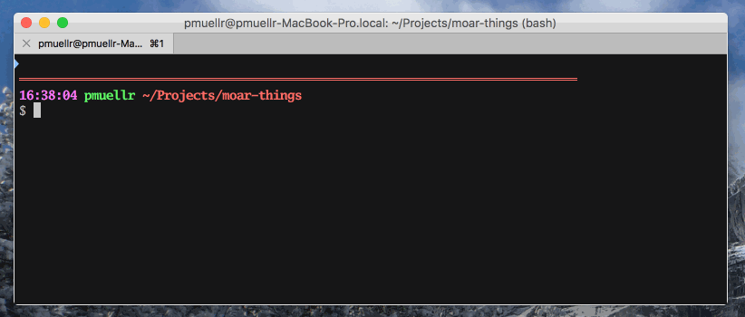

fav-commands - shell utility to pick favorite commands per directory
================================================================================

Running this program will display a menu of commands associated with the current
directory.  The commands are populated from the file `.fav-commands` in the
current directory, and from the `~/.fav-commands-global` file.  All of the
lines in the files become selectable in a menu.

When you select one of the lines from the menu, it will be written to stderr.

Super useful, eh?  So, if you want to actually execute the command, you can
create an alias like this:

    alias fav-commands='fav-commands.js 2> ~/tmp/fav-command-selected.txt; source ~/tmp/fav-command-selected.txt'

Now when you run `fav-commands` (instead of `fav-commands.js`) and select a
line, the selected command will be executed.

usage
================================================================================

    fav-commands.js [options]

### options

| option          | description |
|-----------------|------------------------------------------------------|
| `-h --help`     | print this help |
| `-v --version`  | print the program version |

install
================================================================================

    npm install -g moar-things/fav-commands

license
================================================================================

This package is licensed under the MIT license.  See the
[LICENSE.md](LICENSE.md) file for more information.

contributing
================================================================================

Awesome!  We're happy that you want to contribute.

Please read the [CONTRIBUTING.md](CONTRIBUTING.md) file for more information.
